## I. Convolutional Neural Network (Mạng neuron tích chập)

### I.1. Từ các lớp kết nối đầy đủ đến phép tích chập

#### I.1.1. Hạn chế của Mạng Đa Lớp Perceptron (MLP) với dữ liệu ảnh:

Mạng MLP truyền thống, khi áp dụng cho dữ liệu ảnh, thường yêu cầu quá trình làm phẳng (flattening) ảnh thành một vector. Quá trình này triệt tiêu thông tin về cấu trúc không gian vốn có giữa các pixel lân cận, một đặc điểm quan trọng trong dữ liệu ảnh. Hậu quả là:

1. `Số lượng tham số tăng trưởng theo cấp số nhân`: Với ảnh có độ phân giải cao, số lượng kết nối và do đó, số lượng tham số trong MLP trở nên khổng lồ, dẫn đến khó khăn trong việc huấn luyện hiệu quả và nguy cơ quá khớp (overfitting).
2. `Mất tính cục bộ và bất biến`: MLP không thể hiện một cách tự nhiên tính cục bộ (các pixel gần nhau thường liên quan) và tính bất biến tịnh tiến (một đối tượng được nhận diện dù xuất hiện ở bất kỳ vị trí nào trong ảnh).

#### I.1.2. Sự ra đời của Mạng Neuron Tích chập (CNN):

CNN được phát triển như một kiến trúc mạng neuron chuyên biệt, thiết kế để xử lý dữ liệu có cấu trúc lưới, đặc biệt là dữ liệu ảnh. Mục tiêu chính của CNN là:

1. `Khai thác cấu trúc không gian`: Bằng cách sử dụng các phép toán tích chập, CNN có thể học các đặc trưng cục bộ và mối quan hệ không gian giữa các pixel.
2. `Giảm số lượng tham số`: Các lớp tích chập sử dụng các bộ lọc (kernel) nhỏ được chia sẻ trên toàn bộ ảnh, giúp giảm đáng kể số lượng tham số so với các lớp kết nối đầy đủ trong MLP.
3. `Đạt được tính bất biến và tương đương`: Các phép toán tích chập và các cơ chế khác trong CNN (như pooling) giúp mô hình trở nên bất biến (hoặc tương đương) với các phép tịnh tiến của đối tượng trong ảnh.

Tóm lại, CNN giới thiệu một cách tiếp cận hiệu quả hơn để xử lý dữ liệu ảnh bằng cách tận dụng các đặc tính vốn có của dữ liệu, khắc phục những hạn chế của MLP trong việc duy trì thông tin không gian và kiểm soát số lượng tham số.

#### I.1.3. Tính Bất Biến (Invariance)
Một trong những mục tiêu quan trọng khi xây dựng mô hình cho thị giác máy tính là khả năng nhận diện đối tượng bất kể vị trí của chúng trong ảnh. Ví dụ, một mô hình nhận diện mèo tốt vẫn phải nhận ra con mèo dù nó ở góc trên bên trái hay chính giữa bức ảnh. Khái niệm này được gọi là tính bất biến tịnh tiến.

CNN được thiết kế để hướng tới tính bất biến này thông qua cơ chế của các lớp tích chập và các lớp gộp (pooling), cho phép mô hình học các đặc trưng độc lập với vị trí của chúng trong ảnh.

#### I.1.4. Ràng buộc Mạng Đa Lớp Perceptron (MLP)

Để chuyển đổi từ một lớp kết nối đầy đủ sang một lớp tích chập, chúng ta có thể hình dung việc áp đặt các ràng buộc lên ma trận trọng số của MLP. Xét một ảnh đầu vào $X$ và một lớp ẩn $H$, cả hai đều có cấu trúc không gian hai chiều. Thay vì một ma trận trọng số kết nối mọi pixel đầu vào với mọi đơn vị ẩn, chúng ta sử dụng một tensor trọng số bậc bốn $W$.

Giả sử $X_{i,j}$ là giá trị pixel tại vị trí $[i, j]$ và $H_{i,j}$ là giá trị của đơn vị ẩn tại vị trí tương ứng. Một lớp kết nối đầy đủ có thể được biểu diễn như sau:

$$H_{i,j} = U_{i,j} + \sum_k\sum_lW_{i,j,k,l}X_{k, l}$$

Để đạt được tính bất biến tịnh tiến, chúng ta ràng buộc các trọng số $W_{i,j,k,l}$ sao cho chúng không phụ thuộc vào vị trí tuyệt đối $[i, j]$ của đơn vị ẩn, mà chỉ phụ thuộc vào độ lệch tương đối giữa pixel đầu vào $[k, l]$ và đơn vị ẩn $[i, j]$. Đặt $a = k - i$ và $b = l - j$, ta có $k = i + a$ và $l = j + b$. Khi đó, trọng số trở thành $V_{a,b}$, và độ lệch $U$ trở thành một hằng số $u$. Phương trình trở thành:

$$H_{i,j} = u + \sum_a\sum_bV_{a,b}X_{i+a, j+b}$$

Đây chính là công thức của một `phép tích chập`.

#### I.1.5. Phép tích chập (Convolution)

Phép tích chập là một phép toán toán học giữa hai hàm (hoặc trong trường hợp rời rạc, hai mảng). Trong bối cảnh của CNN, một trong các mảng là ảnh đầu vào (hoặc một bản đồ đặc trưng từ lớp trước đó), và mảng còn lại là một bộ lọc (filter) hay kernel. Bộ lọc này thường có kích thước nhỏ hơn ảnh đầu vào và chứa các trọng số có thể học được.

Phép tích chập được thực hiện bằng cách trượt bộ lọc trên ảnh đầu vào (theo chiều ngang và chiều dọc), và tại mỗi vị trí, tính tổng tích giữa các phần tử của bộ lọc và các phần tử tương ứng của vùng ảnh mà bộ lọc đang phủ lên. Kết quả của phép tích chập là một bản đồ đặc trưng (feature map), thể hiện các vị trí trong ảnh đầu vào nơi bộ lọc phát hiện ra một đặc trưng cụ thể.

Về mặt toán học, phép tích chập 2D rời rạc giữa một ảnh $X$ kích thước $I \times J$ và một bộ lọc $V$ kích thước $K \times L$ tạo ra một bản đồ đặc trưng $H$ kích thước $(I-K+1) \times (J-L+1)$, với phần tử tại vị trí $i, j$ được tính như sau:

$$H_{i,j}=\sum_{a=0}^{K-1}\sum_{b=0}^{L-1}V_{a,b}X_{i+a,j+b}$$

Lưu ý rằng công thức này thực chất là một phép tương quan chéo (cross-correlation). Phép tích chập thực tế trong toán học thường bao gồm một bước lật bộ lọc trước khi thực hiện tổng tích:

$$(X*V)_{i,j}=\sum_{a=0}^{K-1}\sum_{b=0}^{L-1}V_{a,b}X_{i-a,j-b}$$

Tuy nhiên, trong ngữ cảnh học sâu, thuật ngữ "tích chập" thường được sử dụng để chỉ phép tương quan chéo như công thức trên, vì các trọng số trong bộ lọc được học trong quá trình huấn luyện, nên việc lật bộ lọc trước hay không không ảnh hưởng đến khả năng biểu diễn của mô hình.

#### I.1.6. Các Kênh (Channels)

Ảnh màu thường có nhiều kênh, phổ biến nhất là ba kênh màu Đỏ (Red), Lục (Green) và Lam (Blue) (RGB). Do đó, dữ liệu ảnh không chỉ là một ma trận hai chiều mà là một tensor ba chiều (chiều cao × chiều rộng × số kênh).

Để xử lý ảnh đa kênh, các bộ lọc tích chập cũng được mở rộng thêm một chiều tương ứng với số kênh đầu vào. Một bộ lọc cho ảnh RGB sẽ có kích thước $K \times L \times C_{in}$, trong đó $C_{in}$ là số kênh đầu vào (thường là 3). Phép tích chập sẽ được thực hiện trên từng kênh đầu vào, và sau đó các kết quả sẽ được tổng hợp lại để tạo ra một bản đồ đặc trưng hai chiều.

Tương tự, các lớp tích chập cũng có thể tạo ra nhiều kênh đầu ra (bản đồ đặc trưng). Mỗi bộ lọc khác nhau trong một lớp tích chập sẽ học một đặc trưng khác nhau từ ảnh đầu vào, và mỗi bộ lọc sẽ tạo ra một kênh đầu ra riêng biệt. Số lượng kênh đầu ra là một siêu tham số của lớp tích chập. Do đó, đầu ra của một lớp tích chập thường là một tensor bốn chiều (số lượng mẫu × chiều cao × chiều rộng × số kênh đầu ra).

### I.2. Phép Tích chập cho Ảnh (Convolutions for Images)

#### I.2.1. Phép Toán Tương Quan Chéo (The Cross-Correlation Operation)

Trong phép toán tương quan chéo hai chiều, chúng ta bắt đầu với cửa sổ tích chập được đặt ở góc trên bên trái của tensor đầu vào và trượt nó trên tensor đầu vào, cả từ trái sang phải và từ trên xuống dưới. Khi cửa sổ tích chập trượt đến một vị trí nhất định, các phần tử của subtensor đầu vào nằm trong cửa sổ đó và các phần tử của tensor kernel được nhân tương ứng theo từng vị trí, và tensor kết quả được cộng lại để tạo ra một giá trị vô hướng duy nhất. Giá trị này trở thành giá trị của tensor đầu ra tại vị trí tương ứng.

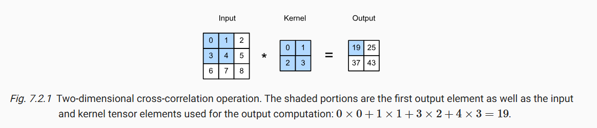

Dọc theo mỗi trục, kích thước đầu ra nhỏ hơn một chút so với kích thước đầu vào. Vì kernel có chiều rộng và chiều cao lớn hơn 1, chúng ta chỉ có thể tính toán chính xác phép tương quan chéo cho các vị trí mà kernel nằm hoàn toàn trong ảnh. Kích thước đầu ra được xác định bởi kích thước đầu vào $n_h \times n_w$ trừ đi kích thước của kernel tích chập $k_h \times k_w$ theo công thức:
$$(n_h-k_h+1)\times(n_w-k_w+1)$$

#### I.2.2. Học một Kernel (Learning a Kernel)

Với các kernel lớn và mạng CNN sâu, việc tự tay thiết kế từng bộ lọc để trích xuất các đặc trưng mong muốn trở nên khó khăn và bất khả thi.     

CNN có khả năng tự động học các kernel (bộ lọc) phù hợp từ dữ liệu thông qua quá trình huấn luyện. Mạng khởi tạo kernel với các giá trị ngẫu nhiên, sau đó sử dụng hàm mất mát để đo lường sự khác biệt giữa đầu ra dự đoán và đầu ra mục tiêu. Gradient descent (hoặc các thuật toán tối ưu hóa khác) được sử dụng để cập nhật các trọng số của kernel nhằm giảm thiểu hàm mất mát này.

uá trình này cho phép mạng tự động khám phá các đặc trưng quan trọng trong dữ liệu, từ các đặc trưng đơn giản (như cạnh) ở các lớp đầu đến các đặc trưng phức tạp hơn ở các lớp sâu hơn.

#### I.2.3. Tương quan chéo và Tích chập

Về mặt toán học, phép tích chập thực sự bao gồm việc lật kernel trước khi thực hiện phép tương quan chéo. Tuy nhiên, trong học sâu, thuật ngữ "tích chập" thường được sử dụng để chỉ phép tương quan chéo. Điều này không gây ra vấn đề vì các trọng số trong kernel được học, và một kernel lật có thể học được cùng một chức năng như một kernel không lật.

#### I.2.4. Bản đồ đặc trưng (Feature map) và Trường tiếp nhận (Receptive Field)

Bản đồ đặc trưng là đầu ra của một lớp tích chập sau khi áp dụng một kernel lên đầu vào. Mỗi bản đồ đặc trưng biểu diễn mức độ mà một đặc trưng cụ thể (được học bởi kernel tương ứng) được phát hiện tại các vị trí khác nhau trong ảnh đầu vào. Các bản đồ đặc trưng này trở thành đầu vào cho các lớp tiếp theo trong mạng.

Đối với một phần tử cụ thể trên một bản đồ đặc trưng ở một lớp nào đó trong CNN, trường tiếp nhận là vùng các pixel trong ảnh đầu vào (hoặc các đặc trưng ở các lớp trước đó) có ảnh hưởng trực tiếp đến giá trị của phần tử đó. Khi mạng trở nên sâu hơn (có nhiều lớp tích chập), trường tiếp nhận của các phần tử ở các lớp sau sẽ lớn hơn, cho phép chúng tổng hợp thông tin từ một vùng rộng hơn của ảnh đầu vào. Điều này cho phép mạng học các đặc trưng phức tạp hơn dựa trên sự kết hợp của các đặc trưng cục bộ.

### I.3. Phần Đệm và Bước Nhảy (Padding and Stride)

Sau nhiều lớp tích chập liên tiếp với kernel lớn hơn 1x1, kích thước của bản đồ đặc trưng thường giảm đáng kể so với kích thước đầu vào ban đầu. Điều này có thể dẫn đến mất thông tin ở biên của ảnh.

Phần đệm (Padding):
- Mục đích: Thêm các pixel ảo (thường có giá trị 0) xung quanh biên của ảnh đầu vào để tăng kích thước hiệu quả của nó.
- Lợi ích:
  - Duy trì kích thước đầu ra: Cho phép lớp tích chập tạo ra bản đồ đặc trưng có cùng kích thước với đầu vào, đặc biệt khi kết hợp với kernel có kích thước phù hợp.
  - Sử dụng hiệu quả các pixel ở biên: Các pixel ở góc và biên của ảnh đầu vào được "tham gia" vào nhiều phép tích chập hơn.
- Kích thước đệm: Nếu thêm $p_h$ hàng đệm (trên và dưới) và $p_w$ cột đệm (trái và phải), kích thước đầu ra sẽ là $(n_h - k_h + p_h + 1) \times (n_w - k_w + p_w + 1)$.
- Đệm để giữ nguyên kích thước: Thông thường, chọn $p_h = k_h - 1$ và $p_w = k_w - 1$ để kích thước đầu ra bằng kích thước đầu vào. Với kernel kích thước lẻ, có thể đệm đều hai bên.

Bước nhảy (Stride):
- Mục đích: Xác định số lượng pixel mà cửa sổ tích chập trượt qua sau mỗi lần tính toán. Mặc định là 1.
- Lợi ích:
  - Giảm kích thước đầu ra (downsampling): Bước nhảy lớn hơn 1 làm giảm kích thước của bản đồ đặc trưng một cách đáng kể, tương tự như lớp gộp (pooling).
  - Tăng hiệu suất tính toán: Giảm số lượng phép tích chập cần thực hiện.
- Kích thước đầu ra với bước nhảy: Với bước nhảy $s_h$ theo chiều cao và $s_w$ theo chiều rộng, kích thước đầu ra là $\lfloor (n_h - k_h + p_h + s_h) / s_h \rfloor \times \lfloor (n_w - k_w + p_w + s_w) / s_w \rfloor$.
- Kết hợp Padding và Stride: Có thể kết hợp cả padding và stride để kiểm soát kích thước đầu ra một cách linh hoạt.
### I.4.  Nhiều Kênh Đầu Vào và Nhiều Kênh Đầu Ra (Multiple Input and Multiple Output Channels)

#### I.4.1. Nhiều kênh đầu vào (Multiple Input Channels)

Ảnh màu thường có nhiều kênh (ví dụ: Đỏ, Lục, Lam - RGB). Mỗi kênh biểu diễn thông tin về cường độ của một màu sắc cơ bản tại mỗi pixel.

Các lớp tích chập trước đó có thể tạo ra nhiều bản đồ đặc trưng, mỗi bản đồ này có thể được coi là một "kênh" thông tin cho lớp tích chập hiện tại. Mỗi kênh này có thể biểu diễn một đặc trưng đã học khác nhau của ảnh đầu vào.

Khi một lớp tích chập nhận đầu vào có nhiều kênh, kernel của nó cũng phải có số lượng kênh đầu vào tương ứng. Phép tích chập được thực hiện riêng rẽ trên từng kênh đầu vào, và sau đó kết quả của các phép tích chập này được tổng hợp lại (thường bằng phép cộng) để tạo ra một bản đồ đặc trưng đầu ra duy nhất (cho mỗi kernel đầu ra).

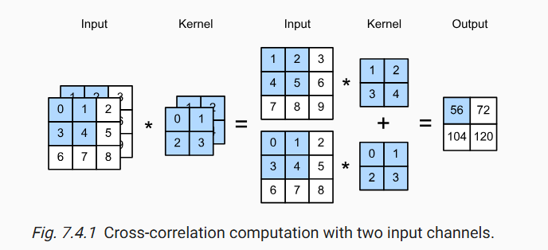

#### I.4.2. Nhiều kênh đầu ra (Multiple Output Channels)

Một lớp tích chập thường có nhiều kernel khác nhau. Mỗi kernel được thiết kế để phát hiện một loại đặc trưng cụ thể trong dữ liệu đầu vào.

Mỗi kernel trong lớp tích chập sẽ tạo ra một bản đồ đặc trưng đầu ra riêng biệt. Các bản đồ đặc trưng này có thể được coi là các "kênh đầu ra" của lớp tích chập. Việc có nhiều kênh đầu ra cho phép lớp tích chập học và biểu diễn đồng thời nhiều đặc trưng khác nhau của dữ liệu đầu vào. Các đặc trưng này sau đó sẽ được sử dụng bởi các lớp tiếp theo trong mạng để thực hiện các tác vụ phức tạp hơn.

#### I.4.3. Lớp tích chập $1 \times 1$:

Đây là một lớp tích chập đặc biệt với kernel có kích thước $1 \times 1$. Lớp $1 \times 1$ có thể được sử dụng để giảm hoặc tăng số lượng kênh trong bản đồ đặc trưng mà không thay đổi kích thước không gian (chiều cao và chiều rộng). Điều này hữu ích cho việc kiểm soát độ phức tạp tính toán và tạo ra các biểu diễn phù hợp cho các lớp tiếp theo. Mặc dù kernel chỉ xem xét một pixel tại một thời điểm trong không gian, nó có thể học các mối quan hệ và tổ hợp thông tin giữa các kênh khác nhau tại cùng một vị trí.

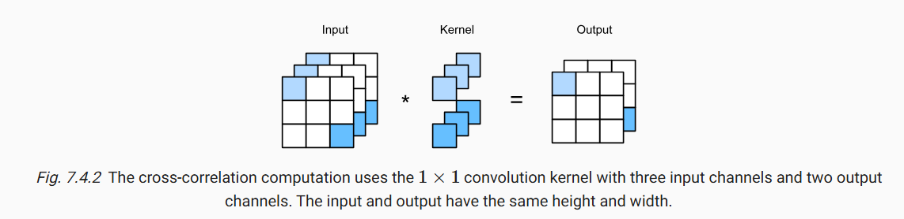

Lớp này thường được sử dụng trong các kiến trúc CNN hiện đại như Inception và ResNet để giảm chiều sâu của các bản đồ đặc trưng trước các lớp tích chập tốn kém hơn về mặt tính toán.

### I.5 Pooling

Pooling là một thành phần quan trọng trong kiến trúc CNN, giúp giảm độ nhạy vị trí của các đặc trưng, giảm kích thước không gian của các biểu diễn và tổng hợp thông tin, góp phần xây dựng các mô hình mạnh mẽ và hiệu quả.

Mục đích của Pooling:
- Giảm độ nhạy vị trí: Làm cho các đặc trưng học được ít nhạy cảm hơn với sự dịch chuyển nhỏ của đối tượng trong ảnh.
- Giảm kích thước không gian (downsampling): Giảm chiều cao và chiều rộng của các bản đồ đặc trưng, giúp giảm số lượng tham số và tính toán ở các lớp sau.
- Tổng hợp thông tin: Tạo ra các biểu diễn thô hơn nhưng mang tính toàn cục hơn, giúp các lớp cuối cùng đưa ra quyết định dựa trên toàn bộ ảnh.

Các loại phép gộp:
- Gộp cực đại (Max Pooling): Chọn giá trị lớn nhất trong cửa sổ gộp. Thường được ưa chuộng hơn vì có xu hướng giữ lại các đặc trưng nổi bật nhất.

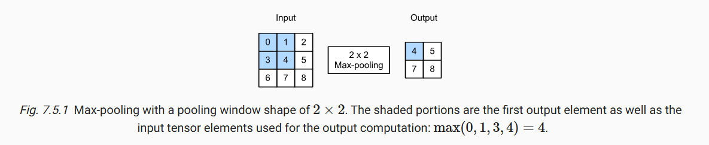

- Gộp trung bình (Average Pooling): Tính giá trị trung bình của các phần tử trong cửa sổ gộp. Có thể làm mịn các đặc trưng.

Tương tự như lớp tích chập, một cửa sổ gộp có kích thước cố định trượt trên bản đồ đặc trưng đầu vào theo một bước nhảy (stride). Tại mỗi vị trí, nó tính toán giá trị cực đại hoặc trung bình của các phần tử trong cửa sổ và tạo ra một phần tử tương ứng trong bản đồ đặc trưng đầu ra. 

Khi xử lý dữ liệu đa kênh, lớp gộp được áp dụng độc lập trên từng kênh đầu vào. Số lượng kênh đầu ra của lớp gộp bằng với số lượng kênh đầu vào.

### I.6. Mạng nơ-ron tích chập (LeNet)

LeNet-5 là một trong những kiến trúc CNN đầu tiên thành công, được đề xuất bởi Yann LeCun và cộng sự cho bài toán nhận dạng chữ số viết tay MNIST. Kiến trúc cơ bản của LeNet-5 bao gồm các lớp sau theo trình tự:
1. `Lớp Convolution 1`: Sử dụng một số lượng kernel (ví dụ: 6) kích thước $5 \times 5$ để trích xuất các đặc trưng cơ bản từ ảnh đầu vào $32 \times 32$ (đã được đệm từ ảnh gốc $28 \times 28$).
2. `Lớp Pooling 1 (AvgPool)`: Với cửa sổ kích thước $2 \times 2$ và bước nhảy 2 để giảm kích thước không gian của các bản đồ đặc trưng.
3. `Lớp Convolution 2`: Sử dụng một số lượng kernel lớn hơn (ví dụ: 16) kích thước $5 \times 5$ để trích xuất các đặc trưng phức tạp hơn.
4. `Lớp Pooling 2 (AvgPool)`: Tương tự như lớp gộp 1, giảm kích thước không gian.
5. `Các lớp kết nối đầy đủ (Fully Connected Layers)`: Các bản đồ đặc trưng sau lớp gộp cuối cùng được làm phẳng thành một vector và được đưa qua một hoặc nhiều lớp kết nối đầy đủ để thực hiện phân loại cuối cùng. LeNet-5 thường có một lớp kết nối với số lượng đơn vị ẩn (ví dụ: 120), sau đó một lớp kết nối khác (ví dụ: 84), và cuối cùng là lớp đầu ra với số lượng đơn vị bằng số lượng lớp cần phân loại (ví dụ: 10 cho các chữ số 0-9).
6. `Hàm kích hoạt`: Các hàm kích hoạt phi tuyến (ví dụ: sigmoid hoặc tanh ban đầu, sau này thường dùng ReLU) được áp dụng sau mỗi lớp tích chập và các lớp kết nối đầy đủ (trừ lớp đầu ra trong bài toán phân loại đa lớp thường dùng softmax).
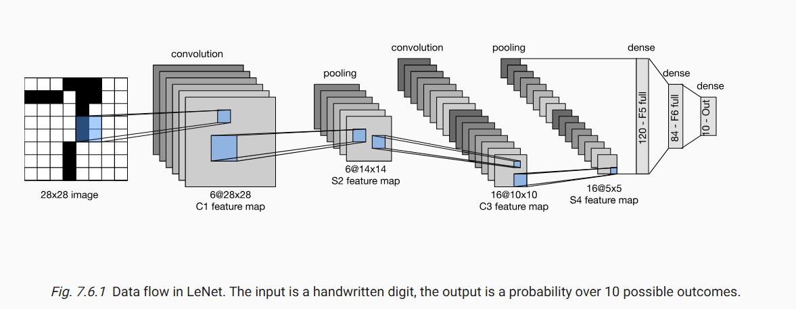

Lập trình mạng Lenet bằng thư viện:
```python
def init_cnn(module):  #@save
    """Initialize weights for CNNs."""
    if type(module) == nn.Linear or type(module) == nn.Conv2d:
        nn.init.xavier_uniform_(module.weight)

class LeNet(d2l.Classifier):  #@save
    """The LeNet-5 model."""
    def __init__(self, lr=0.1, num_classes=10):
        super().__init__()
        self.save_hyperparameters()
        self.net = nn.Sequential(
            nn.LazyConv2d(6, kernel_size=5, padding=2), nn.Sigmoid(),
            nn.AvgPool2d(kernel_size=2, stride=2),
            nn.LazyConv2d(16, kernel_size=5), nn.Sigmoid(),
            nn.AvgPool2d(kernel_size=2, stride=2),
            nn.Flatten(),
            nn.LazyLinear(120), nn.Sigmoid(),
            nn.LazyLinear(84), nn.Sigmoid(),
            nn.LazyLinear(num_classes))
```

## II. Modern Convolutional Neural Networks (Mạng Nơ-ron Tích chập Hiện đại)

### II.1. Mạng Nơ-ron Tích chập Sâu (AlexNet)

AlexNet (Krizhevsky et al., 2012) đã tạo ra một bước đột phá lớn trong thị giác máy tính khi giành chiến thắng trong cuộc thi ImageNet ILSVRC 2012 với một khoảng cách đáng kể. Nó chứng minh sức mạnh của việc học đặc trưng tự động bằng mạng nơ-ron sâu, vượt trội so với các phương pháp dựa trên đặc trưng thiết kế thủ công.

Về kiến trúc, AlexNet là một mạng CNN sâu hơn nhiều so với LeNet, với 8 lớp chính: 5 lớp tích chập và 3 lớp kết nối đầy đủ:

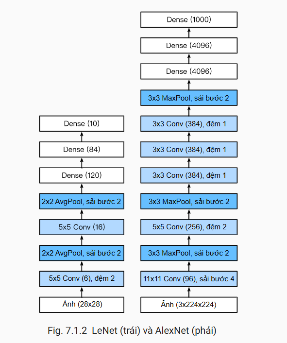

Các triết lý thiết kế của AlexNet và LeNet rất giống nhau, nhưng cũng có những khác biệt đáng kể. Các cải tiến quan trọng so với LeNet:
1. `Hàm kích hoạt ReLU`: AlexNet đã thay hàm kích hoạt sigmoid bằng hàm kích hoạt ReLU đơn giản hơn. Một mặt là giảm việc tính toán, bởi ReLu không có phép lũy thừa như trong hàm kích hoạt sigmoid. Mặt khác, hàm kích hoạt ReLU giúp cho việc huấn luyện mô hình trở nên dễ dàng hơn khi sử dụng các phương thức khởi tạo tham số khác nhau. Điều này là do khi đầu ra của hàm kích hoạt sigmoid rất gần với 0 hoặc 1 thì gradient sẽ gần như bằng 0, vì vậy khiến cho lan truyền ngược không thể tiếp tục cập nhật một số tham số mô hình. Ngược lại, gradient của hàm kích hoạt ReLU trong khoảng dương luôn bằng 1. Do đó, nếu các tham số mô hình không được khởi tạo đúng cách thì hàm sigmoid có thể có gradient gần bằng 0 trong khoảng dương, dẫn đến việc mô hình không được huấn luyện một cách hiệu quả.
2. `Gộp chồng chéo (Overlapping Pooling - MaxPool)`: Sử dụng lớp gộp cực đại với cửa sổ $3 \times 3$ và bước nhảy 2, giúp giảm kích thước không gian và tăng tính bất biến vị trí.
3. `Chuẩn hóa phản hồi cục bộ (LRN)`: Áp dụng chuẩn hóa sau một số lớp tích chập để tăng tính cạnh tranh giữa các neuron (ít được sử dụng trong các kiến trúc hiện đại).
4. `Dropout`: AlexNet kiểm soát năng lực của tầng kết nối đầy đủ bằng cách áp dụng dropout, trong khi LeNet chỉ sử dụng suy giảm trọng số. Alexnet sử dụng dropout với tỷ lệ 0.5 trong các lớp kết nối đầy đủ để giảm overfitting.
5. `Sử dụng GPU`: Tận dụng sức mạnh của nhiều GPU để huấn luyện mạng lớn trên tập dữ liệu ImageNet khổng lồ.
6. `Tăng cường dữ liệu (Data Augmentation)`: Sử dụng các kỹ thuật như cắt ảnh ngẫu nhiên, lật ngang và thay đổi màu sắc để tăng kích thước tập dữ liệu huấn luyện và cải thiện tính tổng quát của mô hình.

Xây dựng mạng trong Python:
```python
from d2l import mxnet as d2l
from mxnet import np, npx
from mxnet.gluon import nn
npx.set_np()

net = nn.Sequential()
net.add(nn.Conv2D(96, kernel_size=11, strides=4, activation='relu'),
nn.MaxPool2D(pool_size=3, strides=2),
nn.Conv2D(256, kernel_size=5, padding=2, activation='relu'),
nn.MaxPool2D(pool_size=3, strides=2),
nn.Conv2D(384, kernel_size=3, padding=1, activation='relu'),
nn.Conv2D(384, kernel_size=3, padding=1, activation='relu'),
nn.Conv2D(256, kernel_size=3, padding=1, activation='relu'),
nn.MaxPool2D(pool_size=3, strides=2),
nn.Dense(4096, activation="relu"), nn.Dropout(0.5),
nn.Dense(4096, activation="relu"), nn.Dropout(0.5),
nn.Dense(1000))
```

AlexNet đã chứng minh tiềm năng to lớn của mạng nơ-ron sâu và học tự động các đặc trưng, mở đường cho sự phát triển của nhiều kiến trúc CNN phức tạp và hiệu quả hơn sau này. Sự thành công của AlexNet phần lớn nhờ vào dữ liệu lớn (ImageNet), sức mạnh tính toán của GPU và các kỹ thuật huấn luyện mới (ReLU, Dropout, Data Augmentation).

### II.2. Networks Using Blocks (VGG)

Sau thành công vang dội của AlexNet, cộng đồng nghiên cứu đã tập trung vào việc khám phá các kiến trúc CNN sâu hơn nữa. Mạng VGG, được đề xuất bởi Simonyan và Zisserman từ Đại học Oxford và giành vị trí thứ hai trong cuộc thi ILSVRC 2014, là một trong những kiến trúc tiên phong trong hướng tiếp cận này. VGG (viết tắt của Visual Geometry Group) nổi bật với sự đồng nhất trong thiết kế, sử dụng các lớp tích chập với kernel nhỏ $3 \times 3$ xếp chồng lên nhau để xây dựng các mạng rất sâu.

Một trong những câu hỏi lớn sau AlexNet là liệu việc tăng độ sâu của mạng có thể dẫn đến hiệu suất tốt hơn hay không. VGG đã nghiên cứu sâu về ảnh hưởng của độ sâu mạng bằng cách giữ các tham số khác tương đối cố định. Thiết kế của VGG tập trung vào việc sử dụng các lớp tích chập có kernel nhỏ kích thước $3 \times 3$ xuyên suốt toàn bộ mạng. Hai lớp tích chập $3 \times 3$ liên tiếp có cùng trường tiếp nhận hiệu quả như một lớp tích chập $5 \times 5$, nhưng lại có ít tham số hơn và nhiều hàm kích hoạt phi tuyến hơn, do đó có khả năng học các biểu diễn phức tạp hơn. Tương tự, ba lớp tích chập $3 \times 3$ liên tiếp có trường tiếp nhận tương đương với một lớp tích chập $7 \times 7$.

Các khối xây dựng cơ bản của mạng VGG bao gồm một chuỗi các lớp tích chập $3 \times 3$ (với padding để duy trì kích thước không gian) theo sau bởi một lớp gộp cực đại (max pooling) kích thước $2 \times 2$ với bước nhảy 2 để giảm kích thước không gian. Các cấu hình khác nhau của VGG (ví dụ: VGG-16, VGG-19) khác nhau về số lượng lớp tích chập trong mỗi khối. Sau các khối tích chập và gộp, mạng thường kết thúc bằng một vài lớp kết nối đầy đủ.

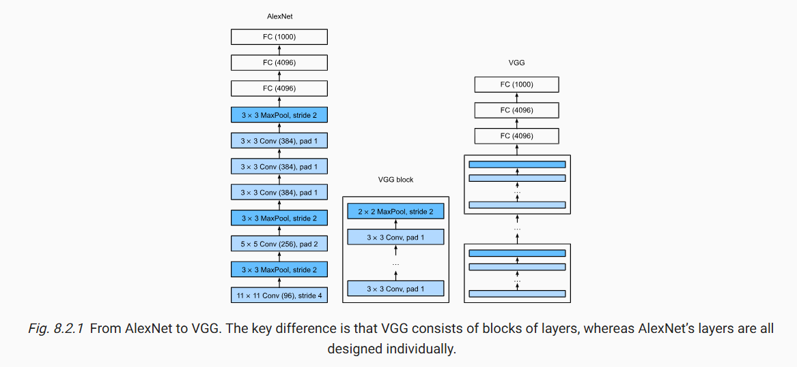

Các con số trong tên của cấu hình VGG thường chỉ tổng số lớp có trọng số (tức là lớp tích chập và lớp kết nối đầy đủ).

Một cấu hình điển hình của VGG-16 có thể được mô tả như sau:
1. Khối 1: 2 lớp tích chập $3 \times 3$ với 64 kênh, theo sau bởi Max Pooling $2 \times 2$.
2. Khối 2: 2 lớp tích chập $3 \times 3$ với 128 kênh, theo sau bởi Max Pooling $2 \times 2$.
3. Khối 3: 3 lớp tích chập $3 \times 3$ với 256 kênh, theo sau bởi Max Pooling $2 \times 2$.
4. Khối 4: 3 lớp tích chập $3 \times 3$ với 512 kênh, theo sau bởi Max Pooling $2 \times 2$.
5. Khối 5: 3 lớp tích chập $3 \times 3$ với 512 kênh, theo sau bởi Max Pooling $2 \times 2$.
6. Lớp FC 1: 4096 đơn vị, kích hoạt ReLU, Dropout.
7. Lớp FC 2: 4096 đơn vị, kích hoạt ReLU, Dropout.
8. Lớp đầu ra: Số lượng lớp cần phân loại, thường sử dụng Softmax.

Ưu diểm chính của kiến trúc VGG:
- `Tính đồng nhất`: Thiết kế đơn giản và nhất quán với việc sử dụng các lớp tích chập $3 \times 3$ giúp dễ dàng hiểu và triển khai.
- `Độ sâu`: VGG chứng minh rằng việc tăng độ sâu của mạng có thể cải thiện hiệu suất đáng kể.
- `Kernel nhỏ hiệu quả`: Việc sử dụng các kernel nhỏ cho phép học các đặc trưng phức tạp hơn với ít tham số hơn so với việc sử dụng một lớp tích chập lớn duy nhất có cùng trường tiếp nhận.

Nhược điểm của kiến trúc VGG:
- `Số lượng tham số lớn`: Mặc dù sử dụng kernel nhỏ, mạng VGG vẫn có số lượng tham số rất lớn, đặc biệt là ở các lớp kết nối đầy đủ. Điều này dẫn đến yêu cầu bộ nhớ lớn hơn và thời gian huấn luyện lâu hơn.
- `Chi phí tính toán cao`: Số lượng phép tính cần thiết trong quá trình huấn luyện và suy luận cũng rất lớn.

Mặc dù có những nhược điểm về số lượng tham số và chi phí tính toán, VGG vẫn là một kiến trúc quan trọng trong lịch sử phát triển của CNN. Nó đã củng cố tầm quan trọng của độ sâu mạng và đặt ra một khuôn mẫu cho các kiến trúc sâu hơn sau này. Nhiều khái niệm thiết kế từ VGG, chẳng hạn như việc sử dụng các lớp tích chập nhỏ xếp chồng lên nhau, vẫn được áp dụng trong các kiến trúc CNN hiện đại.

### II.3. Mạng trong Mạng (Network in Network - NiN)

LeNet, AlexNet và VGG đều có chung một khuôn mẫu thiết kế: trích xuất các đặc trưng khai thác cấu trúc không gian thông qua một chuỗi các phép tích chập và các tầng gộp, sau đó hậu xử lý các biểu diễn thông qua các tầng kết nối đầy đủ. Những cải tiến so với LeNet của AlexNet và VGG chủ yếu nằm ở việc mở rộng và tăng chiều sâu hai mô-đun này. Một lựa chọn khác là ta có thể sử dụng các tầng kết nối đầy đủ ngay từ giai đoạn trước. Tuy nhiên, việc tùy tiện sử dụng các tầng kết nối dày đặc có thể làm mất đi cấu trúc không gian của biểu diễn. Dùng các khối của Mạng trong Mạng (Network in Network - NiN) là một giải pháp thay thế khác. Ý tưởng này được đề xuất trong [Lin et al., 2013] dựa trên một thay đổi rất đơn giản — sử dụng MLP trên các kênh cho từng điểm ảnh riêng biệt.

#### II.3.1. Khối NiN

Khối NiN bao gồm một tầng tích chập theo sau bởi hai tầng tích chập $1 \times 1$ hoạt động như các tầng kết nối đầy đủ trên điểm ảnh và sau đó là hàm kích hoạt ReLU. Kích thước cửa sổ tích chập của tầng thứ nhất thường được định nghĩa bởi người dùng. Kích thước cửa sổ tích chập ở các tầng tiếp theo được cố định bằng $1 \times 1$.
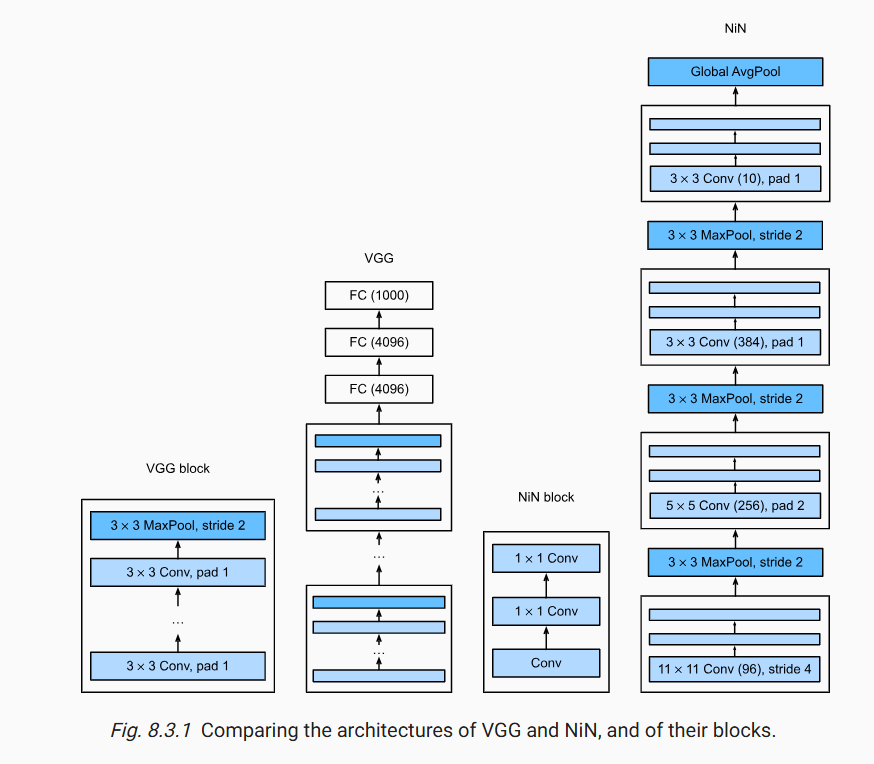

#### II.3.2. Mô hình NiN

NiN sử dụng các tầng tích chập có kích thước cửa sổ $11\times11$, $5\times5$, $3\times3$, và số lượng các kênh đầu ra tương ứng giống với AlexNet. Mỗi khối NiN theo sau bởi một tầng gộp cực đại với sải bước 2 và kích thước cửa sổ $3\times3$.

Một điểm khác biệt đáng chú ý so với AlexNet là NiN tránh hoàn toàn việc sử dụng các kết nối dày đặc. Thay vào đó, mạng này sử dụng các khối NiN với số kênh đầu ra bằng với số lớp nhãn, theo sau bởi một tầng gộp trung bình toàn cục, tạo ra một vector logit. Một lợi thế của thiết kế NiN là giảm được các tham số cần thiết của mô hình một cách đáng kể. Tuy nhiên, trong thực tế, cách thiết kế này đôi lúc đòi hỏi tăng thời gian huấn luyện mô hình.

Xây dựng trong Python:
```python
net = nn.Sequential()
net.add(nin_block(96, kernel_size=11, strides=4, padding=0),
nn.MaxPool2D(pool_size=3, strides=2),
nin_block(256, kernel_size=5, strides=1, padding=2),
nn.MaxPool2D(pool_size=3, strides=2),
nin_block(384, kernel_size=3, strides=1, padding=1),
nn.MaxPool2D(pool_size=3, strides=2),
nn.Dropout(0.5),
# There are 10 label classes
nin_block(10, kernel_size=3, strides=1, padding=1),
# The global average pooling layer automatically sets the window shape
# to the height and width of the input
nn.GlobalAvgPool2D(),
# Transform the four-dimensional output into two-dimensional output
# with a shape of (batch size, 10)
nn.Flatten())
```
### II.4. Mạng nối song song (GoogLeNet)

#### II.4.1. Khối Inception

Khối tích chập cơ bản trong mô hình GoogLeNet được gọi là Inception, nhiều khả năng được đặt tên dựa theo câu nói “Chúng ta cần đi sâu hơn” (“We Need To Go Deeper”) trong bộ phim Inception, sau này đã tạo ra một trào lưu lan rộng trên internet.

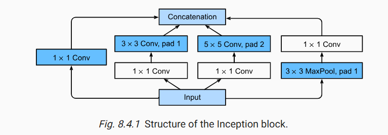

Khối inception bao gồm bốn nhánh song song với nhau. Ba nhánh đầu sử dụng các tầng tích chập với kích thước cửa sổ trượt lần lượt là $1\times1,3\times3,5\times5$ để trích xuất thông tin từ các vùng không gian có kích thước khác nhau. Hai nhánh giữa thực hiện phép tích chập $1\times1$ trên dữ liệu đầu vào để giảm số kênh đầu vào, từ đó giảm độ phức tạp của mô hình. Nhánh thứ tư sử dụng một tầng gộp cực đại kích thước $3\times3$ theo sau là một tầng tích chập $1\times1$ để thay đổi số lượng kênh. Cả bốn nhánh sử dụng phần đệm phù hợp để đầu vào và đầu ra của khối có cùng chiều cao và chiều rộng. Cuối cùng, các đầu ra của mỗi nhánh sẽ được nối lại theo chiều kênh để tạo thành đầu ra của cả khối. Các tham số thường được tinh chỉnh của khối Inception là số lượng kênh đầu ra mỗi tầng.

#### II.4.2. Mô hình GoogLeNet

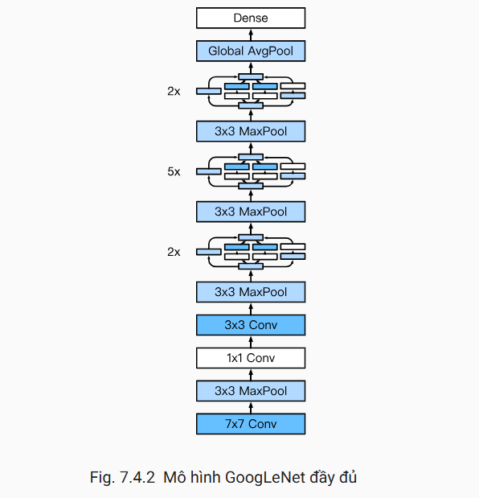

GoogLeNet sử dụng một chồng gồm 9 khối Inception, được sắp xếp thành ba nhóm với gộp cực đại ở giữa, và gộp trung bình toàn cục ở phần đầu để tạo ra các ước tính. Gộp cực đại giữa các khối Inception giúp giảm chiều dữ liệu. Phần đầu của mô hình tương tự như AlexNet và LeNet.

Kiến trúc tổng thể của GoogLeNet bao gồm các thành phần sau:
1. Stem
   - Lớp tích chập với 64 kênh, kernel $7 \times 7$, stride 2, padding 3, ReLU
   - Gộp cực đại với kernel $3 \times 3$, stride 2, padding 1.
2. Module 2:
   - Lớp tích chập $1 \times 1$ với 64 kênh, ReLU.
   - Lớp tích chập $3 \times 3$ với 192 kênh, padding 1, ReLU.
   - Gộp cực đại với kernel $3 \times 3$, stride 2, padding 1.
3. Module 3:
   - Hai khối Inception liên tiếp:
     - Inception 1: Đầu ra 256 kênh (tỉ lệ kênh giữa các nhánh là 2:4:1:1).
     - Inception 2: Đầu ra 480 kênh (tỉ lệ kênh 4:6:3:2).
   - Gộp cực đại với kernel $3 \times 3$, stride 2, padding 1.
4. Module 4:
   - Năm khối Inception liên tiếp:
     - Inception 1: Đầu ra 512 kênh.
     - Inception 2: Đầu ra 512 kênh.
     - Inception 3: Đầu ra 512 kênh.
     - Inception 4: Đầu ra 528 kênh.
     - Inception 5: Đầu ra 832 kênh.
   - Gộp cực đại với kernel $3 \times 3$, stride 2, padding 1.
5. Module 5:
   - Hai khối Inception:
     - Inception 1: Đầu ra 832 kênh.
     - Inception 2: Đầu ra 1024 kênh.
   - Gộp trung bình thích ứng (Adaptive Average Pooling) để giảm chiều cao và chiều rộng của mỗi kênh xuống 1.
   - Flatten.
   - Lớp kết nối đầy đủ với số lượng đầu ra bằng số lượng lớp.

GoogLeNet có kiến trúc phức tạp với nhiều siêu tham số, phản ánh sự thiếu hụt các công cụ tự động hóa thiết kế mạng tại thời điểm nó được đề xuất. Các công cụ hiện đại đã giúp đơn giản hóa việc triển khai các kiến trúc phức tạp như vậy. 

Mô hình GoogLeNet, cũng như các phiên bản kế tiếp của nó, là một trong những mô hình hiệu quả nhất trên ImageNet, với độ chính xác tương tự trên tập kiểm tra nhưng độ phức tạp tính toán lại thấp hơn.

### II.5. Batch Normalization (Chuẩn hóa theo lô)

Batch Normalization (BN) là một kỹ thuật được đề xuất bởi Ioffe và Szegedy (2015) nhằm giải quyết các vấn đề trong quá trình huấn luyện mạng nơ-ron sâu, chủ yếu liên quan đến sự thay đổi phân phối của đầu vào các lớp (internal covariate shift) khi các tham số của các lớp trước đó được cập nhật. BN đã trở thành một thành phần quan trọng và thường được sử dụng trong nhiều kiến trúc mạng nơ-ron hiện đại, đặc biệt là CNN.

#### II.5.1. Vấn đề Internal Covariate Shift

Trong quá trình huấn luyện mạng nơ-ron sâu, các lớp phía sau phải liên tục thích nghi với sự thay đổi trong phân phối của đầu ra từ các lớp phía trước. Sự thay đổi này, được gọi là "internal covariate shift", có thể làm chậm quá trình huấn luyện, đòi hỏi việc sử dụng learning rate nhỏ hơn và khởi tạo tham số cẩn thận hơn, đồng thời gây khó khăn cho việc huấn luyện các mạng rất sâu.

#### II.5.2. Cơ chế hoạt động của Batch Normalization

Batch Normalization chuẩn hóa đầu ra của một lớp (hoặc đầu vào của hàm kích hoạt) trong mỗi mini-batch. Quá trình này bao gồm các bước sau:
1. Tính toán mean và variance của mini-batch: Cho một mini-batch $\mathcal{B} = {x_1, x_2, ..., x_m}$ gồm $m$ giá trị kích hoạt trong một lớp, mean $\mu_{\mathcal{B}}$ và variance $\sigma_{\mathcal{B}}^2$ được tính như sau:
$$\mu_{\mathcal{B}} = \frac{1}{m} \sum_{i=1}^{m} x_i$$   
$$\sigma_{\mathcal{B}}^2 = \frac{1}{m} \sum_{i=1}^{m} (x_i - \mu_{\mathcal{B}})^2$$
2. Chuẩn hóa (Normalization): Các giá trị kích hoạt sau đó được chuẩn hóa bằng cách trừ đi mean và chia cho căn bậc hai của variance (với một hằng số nhỏ $\epsilon$ để tránh chia cho 0):
$$\hat{x}i = \frac{x_i - \mu{\mathcal{B}}}{\sqrt{\sigma_{\mathcal{B}}^2 + \epsilon}}$$
Kết quả là các giá trị $\hat{x}_i$ sẽ có mean gần bằng 0 và variance gần bằng 1.

3. Scale và Shift (Scaling and Shifting): Để cho phép lớp học được các phân phối đầu vào khác (không nhất thiết phải có mean 0 và variance 1), đầu ra chuẩn hóa được scale và shift bằng hai tham số học được là $\gamma$ (gamma) và $\beta$ (beta):
$$y_i = \gamma \hat{x}_i + \beta$$
Các tham số $\gamma$ và $\beta$ được học cùng với các tham số khác của mạng thông qua backpropagation.

#### II.5.3. Lợi ích của Batch Normalization
Việc sử dụng Batch Normalization mang lại nhiều lợi ích quan trọng:

- `Cải thiện quá trình huấn luyện`: BN giúp ổn định quá trình học bằng cách giảm internal covariate shift, cho phép sử dụng learning rate cao hơn mà không lo ngại về sự phân kỳ.
- `Tăng tốc độ hội tụ`: Nhờ việc sử dụng learning rate cao hơn và bề mặt loss function mượt mà hơn, mạng có thể hội tụ nhanh hơn.
- `Giảm sự phụ thuộc vào khởi tạo tham số`: BN làm cho mạng ít nhạy cảm hơn với việc lựa chọn các giá trị khởi tạo ban đầu cho các trọng số.
- `Cho phép huấn luyện các mạng sâu hơn`: Bằng cách giảm các vấn đề liên quan đến gradient biến mất hoặc bùng nổ, BN giúp huấn luyện các mạng với nhiều lớp hơn trở nên khả thi.
- `Hiệu ứng điều chuẩn (Regularization effect)`: BN thêm một chút nhiễu vào các kích hoạt trong quá trình huấn luyện (do tính toán mean và variance trên từng mini-batch), điều này có thể có tác dụng điều chuẩn, giúp giảm overfitting. Đôi khi, nó có thể làm giảm sự cần thiết của dropout.

#### II.5.4. Vị trí sử dụng Batch Normalization
Batch Normalization thường được chèn vào sau các lớp tích chập hoặc lớp kết nối đầy đủ và trước hàm kích hoạt phi tuyến. Tuy nhiên, cũng có những trường hợp BN được áp dụng sau hàm kích hoạt.

### II.6. Mạng phần dư (ResNet) và ResNeXt

Khi thiết kế các mạng nơ-ron ngày càng sâu, việc hiểu cách thêm các lớp có thể tăng độ phức tạp và khả năng biểu diễn của mạng trở nên tối quan trọng. Quan trọng hơn nữa là khả năng thiết kế các mạng mà việc thêm các lớp làm cho mạng thực sự có khả năng biểu diễn tốt hơn thay vì chỉ khác biệt.

#### II.6.1. Lớp hàm

Xét $\mathcal{F}$, lớp các hàm mà một kiến trúc mạng cụ thể (cùng với learning rate và các siêu tham số khác) có thể đạt được. Giả sử $f^*$ là hàm "chân lý" mà chúng ta thực sự muốn tìm. Chúng ta thường cố gắng tìm một $f^*_{\mathcal{F}}$ là ước tính tốt nhất của $f^*$ trong $\mathcal{F}$.

Chỉ khi các lớp hàm lớn hơn chứa các lớp nhỏ hơn (ví dụ, $\mathcal{F}_1 \subseteq \mathcal{F}_2 \subseteq \dots$), chúng ta mới đảm bảo rằng việc tăng kích thước lớp hàm sẽ thực sự tăng khả năng biểu diễn của mạng. Đối với mạng nơ-ron sâu, nếu chúng ta có thể huấn luyện một lớp mới thêm vào thành một hàm đồng nhất $f(x) = x$, thì mô hình mới sẽ hiệu quả ít nhất bằng mô hình ban đầu.

#### II.6.2. Khối Residual (Residual Blocks)

Ý tưởng cốt lõi của mạng Residual Network (ResNet) (He et al., 2016) là làm cho mỗi lớp bổ sung dễ dàng chứa hàm đồng nhất như một phần tử của nó. Thay vì để một khối mạng học trực tiếp một ánh xạ $f(x)$, khối residual học ánh xạ residual $g(x) = f(x) - x$. Nếu ánh xạ đồng nhất $f(x) = x$ là ánh xạ mong muốn, thì ánh xạ residual sẽ là $g(x) = 0$, và việc học ánh xạ này dễ dàng hơn (chỉ cần đẩy các trọng số và bias về 0).

Một khối residual bao gồm các lớp tích chập (thường là hai lớp $3 \times 3$), mỗi lớp được theo sau bởi Batch Normalization và hàm kích hoạt ReLU. Sau đó, đầu vào $x$ được cộng trực tiếp vào đầu ra của hai lớp tích chập trước khi áp dụng hàm ReLU cuối cùng. Kết nối trực tiếp này được gọi là kết nối residual (residual connection) hoặc kết nối tắt (shortcut connection).

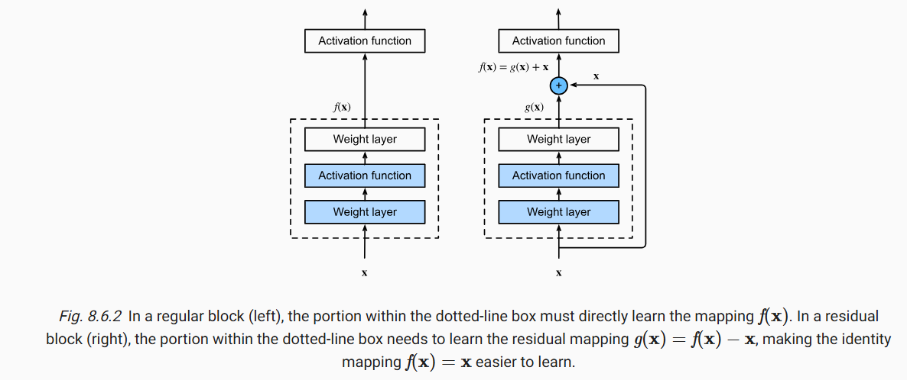

```python
class Residual(nn.Module):
    def __init__(self, num_channels, use_1x1conv=False, strides=1):
        super().__init__()
        self.conv1 = nn.LazyConv2d(num_channels, kernel_size=3, padding=1,
                                   stride=strides)
        self.conv2 = nn.LazyConv2d(num_channels, kernel_size=3, padding=1)
        if use_1x1conv:
            self.conv3 = nn.LazyConv2d(num_channels, kernel_size=1,
                                       stride=strides)
        else:
            self.conv3 = None
        self.bn1 = nn.LazyBatchNorm2d()
        self.bn2 = nn.LazyBatchNorm2d()

    def forward(self, X):
        Y = F.relu(self.bn1(self.conv1(X)))
        Y = self.bn2(self.conv2(Y))
        if self.conv3:
            X = self.conv3(X)
        Y += X
        return F.relu(Y)
```

Để thay đổi số lượng kênh hoặc giảm kích thước không gian, một lớp tích chập $1 \times 1$ được sử dụng trên kết nối tắt $use_1x1conv=True$.
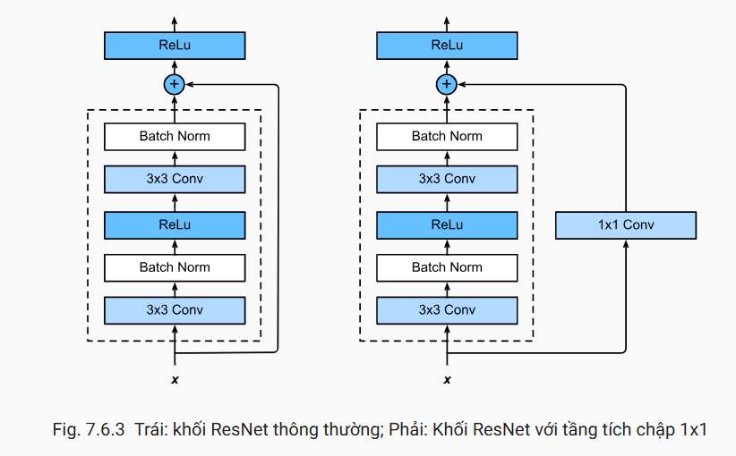

#### II.6.3. Mô hình Resnet

Hai tầng đầu tiên của ResNet giống hai tầng đầu tiên của GoogLeNet: tầng tích chập $7\times7$ với 64 kênh đầu ra và sải bước 2, theo sau bởi tầng gộp cực đại $3\times3$  với sải bước 2. Sự khác biệt là trong ResNet, mỗi tầng tích chập theo sau bởi tầng chuẩn hóa theo batch.
```python
net = nn.Sequential()
net.add(nn.Conv2D(64, kernel_size=7, strides=2, padding=3),
        nn.BatchNorm(), nn.Activation('relu'),
        nn.MaxPool2D(pool_size=3, strides=2, padding=1))
```

ResNet sử dụng bốn mô-đun được tạo thành từ các khối phần dư có cùng số kênh đầu ra. Mô-đun đầu tiên có số kênh bằng số kênh đầu vào. Vì trước đó đã sử dụng tầng gộp cực đại với sải bước 2, nên không cần phải giảm chiều cao và chiều rộng ở mô-đun này. Trong các mô-đun sau, khối phần dư đầu tiên nhân đôi số kênh, đồng thời giảm một nửa chiều cao và chiều rộng.

Cuối cùng, giống như GoogLeNet, ResNet thêm một tầng gộp trung bình toàn cục và một tầng kết nối đầy đủ.

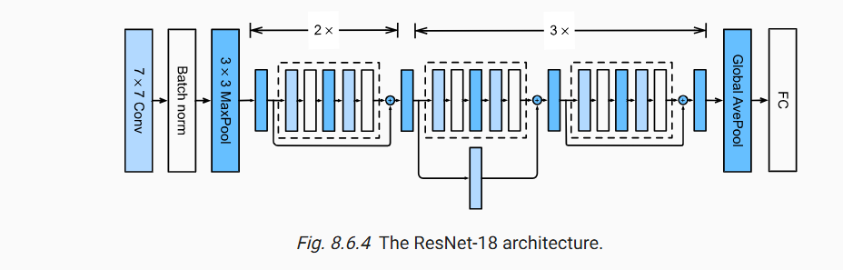


ResNet cho phép huấn luyện các mạng rất sâu (lên đến 152 lớp trong bài báo gốc) nhờ các kết nối residual giúp gradient lan truyền hiệu quả hơn.

## III. 