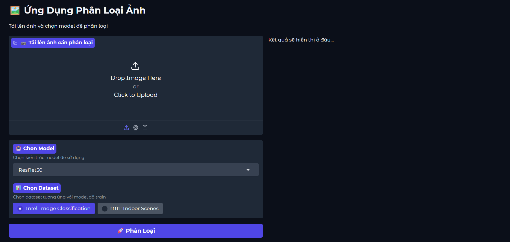

# Image Classification Project
Project là bài tập lớn của học Nhập môn học máy và khai phá dữ liệu (IT3190) với mục tiêu là cài đặt lại các kiến trúc mô hình từ đầu, thực hành việc huấn luyện và đánh giá các mô hình. 

## Thành viên nhóm

| Thành viên | MSSV |
| ---------- | ---- |
| Lê Danh Vinh | 20220051 |
| Nguyễn Đăng Phúc | 20220040 |
| Vũ Trường An | 20220058 |
| Nguyễn Ngọc Kiệt | 20220052 |

## Cài đặt (Install & Config)

1. Tạo môi trường ảo trên Windows
- Nhấn  <Win + R> gõ “cmd” để mở Command Prompt
- Di chuyển đến thư mục muốn tạo môi trường ảo thông qua lệnh “cd” . Ví dụ: cd D:/test
- Tải repository
```
git clone https://github.com/DanhVinhLe/ML20242.git
cd ML20242
```
- Tạo môi trường ảo bằng lệnh sau: python -m venv venv
- Sử dụng lệnh venv\Scripts\activate để kích hoạt môi trường ảo

2. Cài đặt thư viện cần thiết
```
pip install -r requirements.txt
```

## Train Model 
- Thực hiện train mô hình với một dataset bất kì:
Chạy với scripts đơn giản:
```bash
python train.py \
    --train_dir=<train_data_directory> \
    --test_dir=<test_data_dir> \
    --input_size=224 \
    --batch_size=64 \
    --num_epochs=50 \
    --learning_rate=1e-4 \
    --model_name="resnet18" \
    --dropout_rate=0.4 
```

Để tìm hiểu nhiều hơn về các tham số phục vụ cho việc training model, xem trong file [train.py](train.py), hoặc có thể chạy theo mẫu trong [notebook](example/train_vgg16.ipynb)

- Thực hiện train mô hình với tập dữ liệu **MNIST** 
Chạy với scripts đơn giảngiản
```bash
python train.py \
    --mnist_data_dir=<data_dir> \
    --model_name='lenet' \
    --num_epochs=50 \
    --learning_rate=1e-4 \
    --batch_size=64 \
    --input_size=28 
```
Để tìm hiểu nhiều hơn về các tham số phục vụ cho việc training model, xem trong file [train.py](train.py), hoặc có thể chạy theo mẫu trong [file notebook](example/train_mnist_SVM_LeNet.ipynb)

## Demo
Để thực hiện chạy Demo các mô hình đã được train, thực hiện chạy lệnh 
```bash
python demo.py
```
Khi đó, nhấp vào link của **gradio** để thực hiện chạy thử, với giao diện


**Lưu ý:**
- Các phiên bản **weight** hiện chỉ tương thích với **config** của mô hình được **pretrained** từ **torchvision**. 
- Cần chọn đúng task phân loại ứng với đúng.
- Cần đặt tên **weight** theo đúng tên mô hình và phải được chứa trong folder ứng với tên của task phân loại sử dụng (Ví dụ sử dụng mô hình ResNet18, thì cần đặt tên **weight** là `ResNet18.pth` và được chứa trong folder `intel` nếu sử dụng cho **Intel Image Classification** hoặc folder `mit` nếu sử dụng cho **MIT Indoor Scenes**)
- Thông tin chi tiết được thể hiện ở phần `Thông tin chi tiết` của giao diện `demo`. 